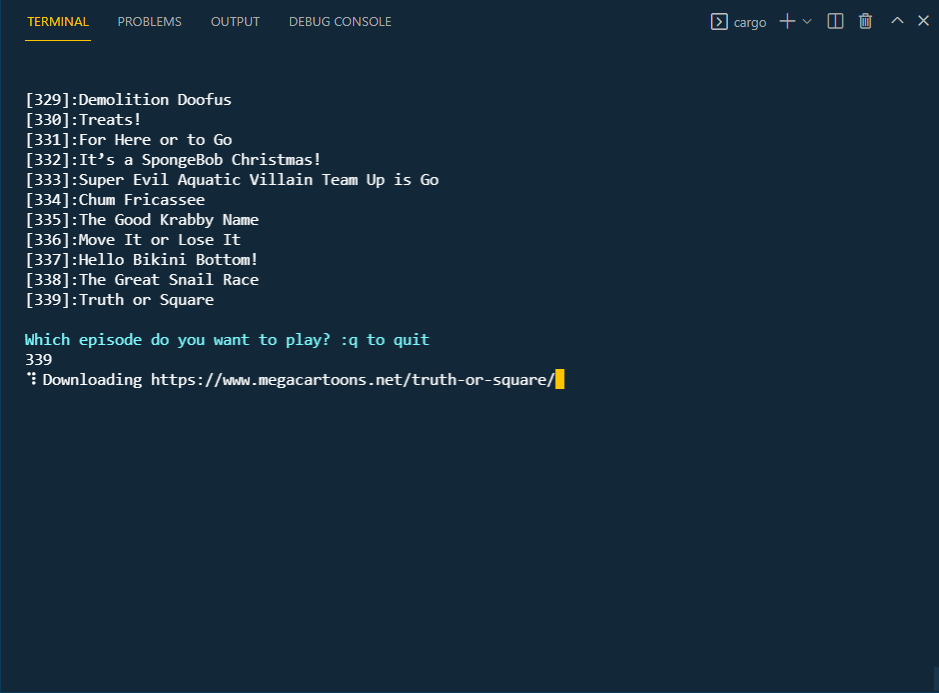
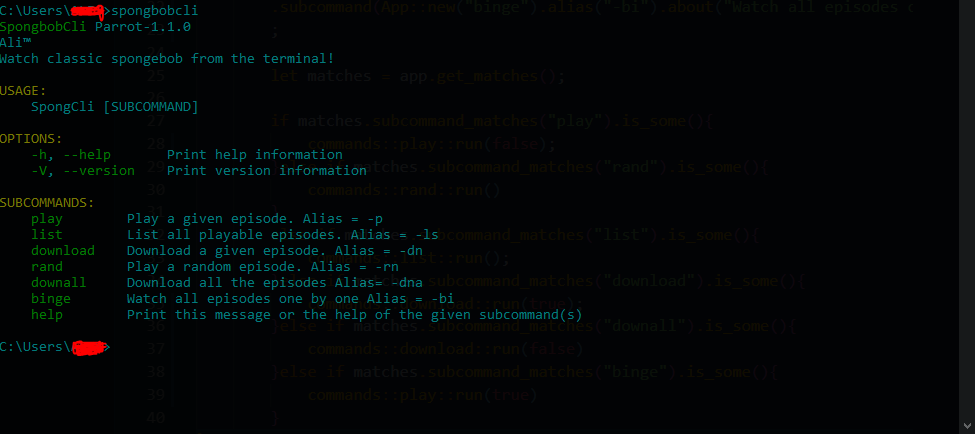

# spongebob-cli Rust
Watch classic spongebob from the terminal!
``
Note: THIS PROJECT IS A REMAKE OF THE ORIGINAL SPONGBOBCLI (originally written in Python) IN RUST
  ``
[Link to original Project](https://github.com/trakBan/spongebob-cli)

### Dependecies:
-   mpv player  [https://mpv.io/](https://mpv.io/)  (Must be installed through a package manager and added to path ENV)
- Youtube-dl [Official Repo](https://github.com/ytdl-org/youtube-dl) ( Must be installed and added to ENV PATH)
<h1>The main entry point is in ./src/main.rs</h1>

### Currently In development
This is just a small project i picked to learn Rust ♥

# Things to fix
- Add Downloading all videos feature
- Refactor Things

# Contributing
Clone the repo. Make sure you have mpv installed to path. Work on the feature that you want. Make sure to create change logs before making a pull request.